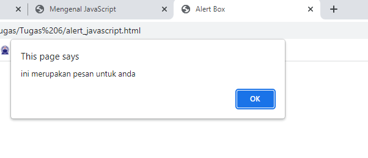
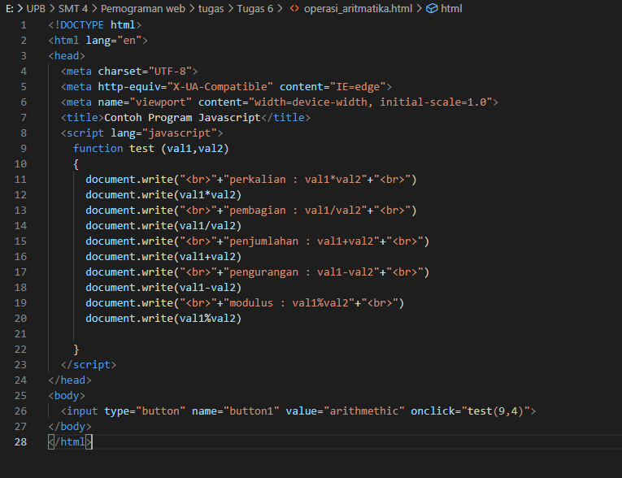

# Lab5Web
## Praktikum 5 : Java Script

## A. Langkah-Langkah Praktikum
Persiapan membuat dokumen HTML dengan nama file lab5_javascript.html seperti berikut.

`<!DOCTYPE html>`
<html lang="en">
`<head>`
`    <title>Mengenal JavaScript</title>`
`</head>`
`<body>`
    `<h1>Pengenalan Javascript</h1>`
    `<h3>Contoh document.write dan console.log</h3>`
    ``
`</body>`
`</html>`

Tampilan contoh Javascript pada browser.

## Javascript Dasar
## 1. Pemakaian Alert sebagai property window.
Selanjutnya kita akan menampilkan Alert box dengan Javascript. Masukan Kode seperti di bawah ini :

`<!DOCTYPE html>`
`<html lang="en">`
  `<head>`
    `<meta charset="UTF-8" />`
    `<meta http-equiv="X-UA-Compatible" content="IE=edge" />`
    `<meta name="viewport" content="width=device-width, initial-scale=1.0" />`
    `<title>Alert Box</title>`
  `</head>`
  `<body>`
    ``
  `</body>`
`</html>`

Tampilan contoh Alert Box pada browser.

## 2. Method dalam objek
Disini kita mencoba memakai javascript sebagai objek. Masukkan kode berikut :

`<!DOCTYPE html>`
`<html lang="en">`
`<head>`
  `<meta charset="UTF-8">`
  `<meta http-equiv="X-UA-Compatible" content="IE=edge">`
  `<meta name="viewport" content="width=device-width, initial-scale=1.0">`
  `<title>Script JavaScript</title>`
`</head>`
`<body>`
  Percobaan memakai javascript: ` `
  ``
`</body>`
`</html>`

Tampilan contoh Method dalam objek pada browser.

## 3. Prompt
Prompt digunakan untuk memasukkan data, bentuknya sama seperti alert box. kita masukkan kode berikut :

`<!DOCTYPE html>`
`<html lang="en">`
`<head>`
  `<meta charset="UTF-8">`
  `<meta http-equiv="X-UA-Compatible" content="IE=edge">`
  `<meta name="viewport" content="width=device-width, initial-scale=1.0">`
  `<title>Pemasukan Data</title>`
`</head>`
`<body>`
  ``
`</body>`
`</html>`

Tampilan contoh pada browser.

jika kita ketik sebuah nama, maka akan muncul kalimat 'hai, (nama)'.

## 4. On load
sama seperti alert box, masukkan kode berikut :

`<!DOCTYPE html>`
`<html lang="en">`
  `<head>`
    `<title>Contoh program javascript</title>`
    ``
  `</head>`
  `<body onload="pesan()">`
  `</body>`
`</html>`

Tampilan hasil pada browser.

## 5. Operasi Aritmatika
Operasi dasar aritmatika menggunakan JavaScript. Ketiklah kode berikut :

`<!DOCTYPE html>`
`<html lang="en">`
`<head>`
  `<meta charset="UTF-8">`
  `<meta http-equiv="X-UA-Compatible" content="IE=edge">`
  `<meta name="viewport" content="width=device-width, initial-scale=1.0">`
  `<title>Contoh Program Javascript</title>`
  ``
`</head>`
`<body>`
  `<input type="button" name="button1" value="arithmethic" onclick="test(9,4)">`
`</body>`
`</html>`

Tampilan hasil pada browser.

Jika kita klik tombol tersebut, maka akan muncul aritmatikanya.

## 6. If - Else
Sekarang kita akan membuat program if else. Program yang dibuat pada Praktikum ini adalah nilai rendah dan tinggi. jika kita masukan nilai diatas 60, maka program akan menampilkan hasil 'lulus', Sebaliknya jika kita masukan nilai di bawah 60 maka program akan menampilkan hasil 'tidak lulus'. berikut kodenya :

`<!DOCTYPE html>`
`<html lang="en">`
`<head>`
  `<meta charset="UTF-8">`
  `<meta http-equiv="X-UA-Compatible" content="IE=edge">`
  `<meta name="viewport" content="width=device-width, initial-scale=1.0">`
  `<title>Contoh if-else</title>`
`</head>`
`<body>`
  ``
`</body>`
`</html>`

Tampilan hasil pada browser.

Jika kita masukan nilai 60, maka akan muncul hasilnya keterangan hasil : Lulus.

## 7. Operator Switch
Penggunaan operator switch untuk seleksi kondisi, Ketik kode berikut :

`<!DOCTYPE html>`
`<html lang="en">`
`<head>`
  `<meta charset="UTF-8">`
  `<meta http-equiv="X-UA-Compatible" content="IE=edge">`
  `<meta name="viewport" content="width=device-width, initial-scale=1.0">`
  `<title>Contoh program javascript</title>`

  ``
`</head>`
`<body>`
  `<input type="button" name="button1" value="switch" onclick="test()">`
`</body>`
`</html>`

Tampilan hasil pada browser.

Jika kita klik tombol tersebut, maka akan muncul tampilan berikut, menunjukan bilangan yang kita pilih, yaitu angka 0-5.

Jika yang kita masukan adalah bilangan yang lebih dari 5, maka akan menampikan hasil 'bilangan lainnya'.

## 8. Form Input
Ketik kode seperti berikut.

`<!DOCTYPE html>`
`<html lang="en">`
`<head>`
  `<meta charset="UTF-8">`
  `<meta http-equiv="X-UA-Compatible" content="IE=edge">`
  `<meta name="viewport" content="width=device-width, initial-scale=1.0">`
  `<title>form input</title>`

  ``
`</head>`
`<body>`
  `<form method="post" name="kirim">`
    `
BIL <input type="text" name="T1" size="20"> MERUPAKAN BIL <input type="text" name="T2" size="20">
`
    `
<input type="button" value="tebak" name="B1" onclick="test()">
`
  `</form>`
`</body>`
`</html>`

Tampilan hasil pada browser.

## 9. Form Button
Pada Praktikum ini, akan di tunjukkan bagaimana cara merubah warna background dan warna font hanya dengan mengklik tombol.

ketik kode berikut :

`<!DOCTYPE html>`
`<html lang="en">`
`<head>`
  `<meta charset="UTF-8">`
  `<meta http-equiv="X-UA-Compatible" content="IE=edge">`
  `<meta name="viewport" content="width=device-width, initial-scale=1.0">`
  `<title>objek document</title>`
`</head>`
`<body>`
  ``

  `<h1>Test</h1>`
  `<form>`
    `<input type="button" value="Latar Belakang Hijau" onclick="ubahWarnaLB('green')">`
    `<input type="button" value="Latar Belakang Putih" onclick="ubahWarnaLB('white')">`
    `<input type="button" value="teks kuning" onclick="ubahWarnaLD('yellow')">`
    `<input type="button" value="teks biru" onclick="ubahWarnaLD('blue')">`
  `</form>`
  ``
`</body>`
`</html>`

Tampilan hasil pada browser.

## 10. HTML DOM
Pilihan menggunakan checkBox dengan perhitungan otomatis. 

Ketiklah kode berikut.

`<!DOCTYPE html>`
`<html lang="en">`
`<head>`
  `<meta charset="UTF-8">`
  `<meta http-equiv="X-UA-Compatible" content="IE=edge">`
  `<meta name="viewport" content="width=device-width, initial-scale=1.0">`
  `<title>Daftar menu</title>`
  ``
`</head>`
`<body>`
  `<h1>Daftar Menu Makanan</h1>`
  `<label><input type="checkbox" value="5000" id="menu1" onclick="hitung(this);" />Ayam Goreng Rp. 5000</label> `
  `<label><input type="checkbox" value="500" id="menu2" onclick="hitung(this);" />Tempe Goreng Rp. 500</label> `
  `<label><input type="checkbox" value="2500" id="menu3" onclick="hitung(this);" />Telur Dadar Rp. 2.500</label> `
  `<strong>Total Bayar: Rp. <input id="total" type="text"/></strong>`
`</body>`
`</html>`

Tampilan hasil pada browser.

## B. Tugas

Membuat script untuk melakukan validasi pada isian form.
Ketikan kode berikut.

`<!DOCTYPE html>`
`<html>`
`<head>`
    `<title>Membuat Form Validasi dengan Javascript</title>`
    `<link rel="stylesheet" type="text/css" href="Tugas.css">`
`</head>`
`<body>`
    `<!-- Judul -->`
    `
<h2>Membuat Form Validasi</h2>
`
`
`
    `<form action="#" method="POST" onsubmit="validasi()">`
        `
`
            `<label>Nama Lengkap :</label>`
            `<input type="text" name="nama" id="nama"/>`
        `
`
        `
`
            `<label>Email :</label>`
            `<input type="email" name="email" id="email"/>`
        `
`
        `
`
            `<label>Alamat :</label>`
            `<textarea cols="40" rows="5" name="alamat" id="alamat"></textarea>`
        `
`
        `
`
            `<input type="submit" value="Daftar" class="tombol">`
        `
`

        `<footer>`
            `
`
            `
2022 - Anggi Perdana - Form Validasi
`
            `
Universitas Pelita Bangsa
`
        `</footer>`
    `</form>`
`
`
`</body>`
``
`</html>`

Tambah dan buat juga file css berikut.

Tampilan hasil form pada browser.

Karena ini form validasi, maka apabila ada kesalahan atau kekurangan input, tampilannya akan seperti berikut ini. 

